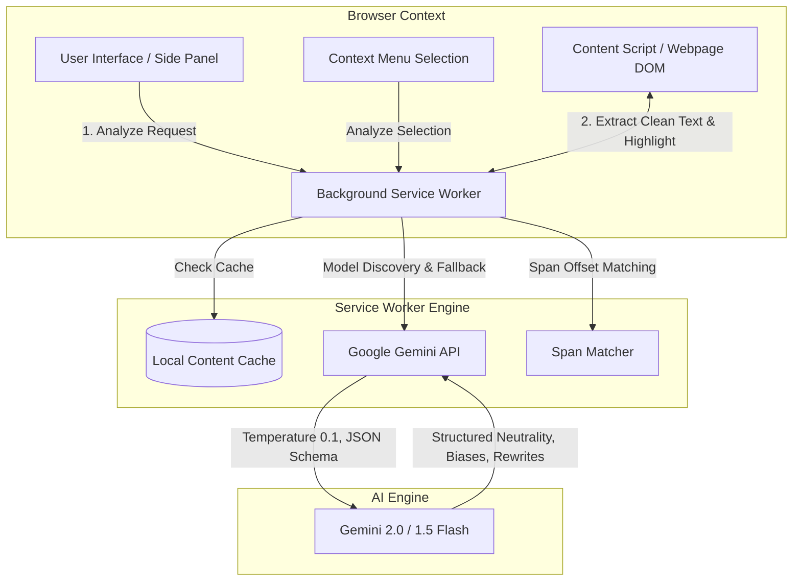

# 🔍 BiasLens — Editorial Precision Cognitive Bias Instrument

> **Read between the lines.** An editorial-grade Chrome browser extension powered by Google Gemini AI that detects cognitive biases, logical fallacies, and manipulative rhetoric in webpages and text passages in real-time. Highlights biased claims directly on the page, calibrates an objective Neutrality Index, and provides surgical sentence-by-sentence neutral revisions.

[](https://developer.chrome.com/docs/extensions/mv3/)
[](https://ai.google.dev/)
[](https://wxt.dev/)
[](https://impeccable.style)
[](LICENSE)
[](https://hyperbloom-hacks.devpost.com/)

---

## 📑 Table of Contents

- [The Problem & Solution](#-the-problem--solution)
- [Key Innovations & Features](#-key-innovations--features)
- [The 13-Type Bias Taxonomy](#-the-13-type-bias-taxonomy)
- [How to Install & Set Up](#-how-to-install--set-up)
- [User Guide (How to Use BiasLens)](#-user-guide-how-to-use-biaslens)
- [Technical Architecture](#-technical-architecture)
- [Design Philosophy: Impeccable Craft](#-design-philosophy-impeccable-craft)
- [Troubleshooting & FAQ](#-troubleshooting--faq)
- [Project Disclosure & Hackathon Details](#-project-disclosure--hackathon-details)

---

## 💡 The Problem & Solution

### The Information Epidemic
Every day, readers consume thousands of words across journalism, opinion columns, political commentary, and social platforms. Much of this discourse is shaped by subtle cognitive biases, emotional manipulation, and informal fallacies designed to nudge perceptions without presenting sound evidence.

### Why Fact-Checkers Aren't Enough
Existing tools focus almost exclusively on **binary fact-checking** (*"Is this claim statistically true or false?"*). However, the most insidious manipulation rarely involves outright fabrication:
- A statement can be **100% factually accurate while being deeply manipulative** through loaded vocabulary, cherry-picked statistics, false dichotomies, and passive-voice framing.

### The BiasLens Solution
**BiasLens acts as an editorial lens in your browser.** It evaluates the *rhetorical architecture* of text, surfacing:
1. **Which specific sentences** rely on manipulative rhetoric.
2. **Which fallacy or bias** is being deployed.
3. **Why it distorts objectivity** and its rhetorical impact.
4. **How to rewrite only the biased sentences neutrally**, keeping the surrounding non-biased context completely intact.

---

## ⚡ Key Innovations & Features

### 1. 🔍 Deep Full-Page Scanning (Up to 65,000 Characters)
- **High-Capacity Pipeline**: Analyzes longform journalism, essays, and complete Wikipedia articles (up to ~10,000–12,000 words).
- **Intelligent DOM Scrubber**: Automatically clones and sanitizes the content tree, stripping out navigational junk, Tables of Contents (`#toc`), infobox tables, citation superscripts (`[1]`), section edit tags, and ads before analysis so 100% of the token budget is focused on actual prose.

### 2. 🎯 Cross-Element In-Situ Page Highlights
- **Beyond Single-Node Matchers**: Traditional extensions fail when text contains hyperlinks (`<a>`), bold words (`<b>`), or footnote citations because the browser splits them into disconnected text nodes.
- **Resilient Multi-Node Traversal**: BiasLens maps character offsets across complex DOM trees, highlighting biased sentences seamlessly across formatting boundaries.
- **Interactive Tooltips**: Hover over any highlighted sentence on a live webpage to view the bias classification, severity, explanation, and neutral suggestion.

### 3. ⚖️ Editorial Neutrality Calibration Scale (0–100)
- Replaces generic circular progress rings with a calibrated linear gauge and multi-metric breakdown:
  - **Verdict Indicator**: Verified Neutral, Minor Slant, Moderately Biased, or Heavily Manipulative.
  - **Diagnostic Metrics**: Density of biased statements, primary bias cluster, and severity distribution.
  - **Category Radar Chart**: Interactive radar visualization mapping rhetorical tendencies across the taxonomy.

### 4. ✂️ Targeted Surgical Rewrites (LCS Word Diff)
- **No Vague Meta-Summaries**: Unlike generic AI summaries that hallucinate or rewrite neutral sentences, BiasLens focuses strictly on the biased parts.
- **Sentence-by-Sentence Breakdown**: Inspect each biased sentence alongside its neutral counterpart with a **Longest Common Subsequence (LCS)** word diff showing exact deleted and replaced words.
- **In-Context Passage Mode**: View the complete article with *only* the biased sentences replaced by neutral revisions, highlighted in green for seamless before/after reading.

### 5. 🔒 Deterministic Audits & Content-Hash Caching
- **Low-Temperature Calibration**: Gemini calls are locked to `temperature: 0.1` and `topP: 0.8` with strict salience ordering, ensuring reproducible, consistent results.
- **Instantaneous Local Cache**: Computes a deterministic content hash of the analyzed text. Re-scanning an identical page returns the audit immediately with zero latency and zero wasted API quota.

### 6. 🛡️ Privacy-First Architecture
- **Direct-to-Google**: Communicates strictly with Google's official Gemini endpoint.
- **No Middleman / No Telemetry**: Your API key and page contents are never logged, proxied, or sent to external servers. Credentials reside exclusively in encrypted local browser storage (`chrome.storage.local`).

---

## 🧬 The 13-Type Bias Taxonomy

BiasLens identifies and categorizes 13 distinct cognitive biases and rhetorical techniques:

| Bias Type | Visual Token | Description & Impact | Real-World Example |
|---|---|---|---|
| **Framing** | `#3b82f6` (Blue) | Presenting information in a selective context to predetermine emotional or cognitive interpretation. | *"The program surrendered \$50M in taxpayer funds"* vs. *"The program allocated \$50M for regional infrastructure."* |
| **Loaded Language** | `#f59e0b` (Amber) | Using words with heavy emotional connotations to bypass critical reasoning. | *"The regime's catastrophic blunder unleashed sheer chaos."* |
| **Appeal to Emotion** | `#f43f5e` (Rose) | Exploiting fear, pity, pride, or outrage instead of establishing logical validity. | *"If we don't pass this bill tomorrow, our children will suffer the devastating consequences."* |
| **False Dichotomy** | `#f97316` (Orange) | Artificially reducing a complex multi-factor spectrum into only two opposing extremes. | *"You are either with our economic policy, or you want the nation to fail."* |
| **Ad Hominem** | `#a855f7` (Purple) | Attacking the author's character, background, or motive rather than refuting their argument. | *"We can ignore this medical study because the author previously worked for a biotech startup."* |
| **Appeal to Authority** | `#14b8a6` (Teal) | Treating an assertion as infallible simply because an authority or celebrity endorsed it. | *"Leading celebrities agree this supplement guarantees peak health."* |
| **Bandwagon** | `#06b6d4` (Cyan) | Arguing a proposition must be true or moral because the majority believes it. | *"Over 70% of surveyed citizens cannot be wrong about this regulation."* |
| **Straw Man** | `#6366f1` (Indigo) | Misrepresenting or exaggerating an opposing viewpoint to make it easier to dismantle. | *"Proponents of urban transit simply want to ban all private vehicles immediately."* |
| **Slippery Slope** | `#ef4444` (Red) | Claiming an initial modest action will inevitably trigger a disastrous chain reaction without proof. | *"If we allow this minor zoning change, the entire historic character of our state will vanish."* |
| **Hasty Generalization** | `#22c55e` (Green) | Reaching a sweeping conclusion based on an insufficient or anecdotal sample size. | *"I interviewed two small business owners who disliked the policy, proving it hurts commerce."* |
| **Cherry Picking** | `#eab308` (Yellow) | Suppressing contradictory facts while highlighting only data points that support a preconceived agenda. | *"Citing only the single profitable quarter while ignoring five consecutive years of net losses."* |
| **False Causation** | `#ec4899` (Pink) | Conflating correlation with direct causation (*post hoc ergo propter hoc*). | *"Crime rates dropped after the billboard was installed, demonstrating its deterrent power."* |
| **Whataboutism** | `#8b5cf6` (Violet) | Deflecting legitimate critique by counter-accusing an unrelated party of equal or worse conduct. | *"Why investigate this municipal budget shortfall when neighboring cities have larger deficits?"* |

---

## 🛠️ How to Install & Set Up

### Prerequisites
- Google Chrome (or any Chromium browser: Brave, Edge, Arc).
- [Node.js](https://nodejs.org/) (v18 or newer) and `npm`.
- A free **Google Gemini API Key** (takes 30 seconds at [aistudio.google.com/apikey](https://aistudio.google.com/apikey)).

### 1. Clone & Install Dependencies
```bash
git clone https://github.com/O-076/BiasLens.git
cd BiasLens
npm install
```

### 2. Build the Extension
```bash
npm run build
```
This bundles the production extension into `.output/chrome-mv3/` using Vite and WXT.

### 3. Load the Extension in Chrome
1. In Chrome, open `chrome://extensions/`.
2. Toggle **Developer mode** on (top-right corner).
3. Click **Load unpacked** (top-left button).
4. Select the `.output/chrome-mv3` directory inside the `BiasLens` folder.
5. Click the **Puzzle piece icon** in your Chrome toolbar and **Pin 📌 BiasLens** for easy access.

### 4. Enter Your Gemini API Key
1. Click the **BiasLens** icon to open the side panel.
2. Click the **Gear icon (⚙️)** in the top right to open **Preferences & Credentials**.
3. Paste your Gemini API key (`AIzaSy...`) into the key field.
4. Click **Save Key**. The status indicator will switch to **Ready**.

---

## 📖 User Guide (How to Use BiasLens)

### Mode 1: Active Webpage Analysis
1. Navigate to any news article, editorial, blog post, or Wikipedia page.
2. Open the **BiasLens Side Panel** by clicking the toolbar icon.
3. Verify the switcher is on **Active Tab** and click **Analyze Active Tab**.
4. Within seconds:
   - Biases will be highlighted directly on the live webpage.
   - The side panel will display the calibrated Neutrality Index, summary, and category radar chart.
   - Scroll down in the webpage to see tooltips on highlighted sentences.

### Mode 2: Manual Text / Paste Mode
1. In the side panel, toggle the mode switcher to **Manual Text**.
2. Paste any statement, email draft, political speech, or press release into the text box.
3. *Tip:* Try one of the built-in sample pills (**News Article**, **Opinion Editorial**, or **Social Media Post**).
4. Click **Analyze Text** to inspect the detailed rhetorical audit.

### Mode 3: Right-Click Context Menu
1. Highlight any sentence or paragraph on any webpage.
2. Right-click the selected text.
3. Select **"Analyze with BiasLens"**.
4. The side panel will open automatically with the targeted analysis.

### Mode 4: Reviewing Targeted Neutral Rewrites
Scroll to the **Targeted Neutral Revisions** section at the bottom of the audit report:
- **Sentence by Sentence**: Inspect each biased sentence, see its direct neutral replacement, and view the word-by-word diff of added/removed vocabulary.
- **In-Context Passage**: Read the entire passage with only the biased sentences replaced. Click **Copy Corrected Text** to export the sanitized text to your clipboard.

---

## 🏛️ Technical Architecture



### Component Breakdown
- **`entrypoints/background.ts`**: Manifest V3 service worker managing messaging pipelines, content-hash caching, and context menu actions.
- **`entrypoints/content.ts`**: Injected script performing out-of-DOM sanitized text extraction and resilient multi-node DOM tree highlighting with interactive hover cards.
- **`lib/gemini.ts`**: Client integrating Google Generative AI SDK with auto-discovery of available models, quota protection, dynamic failover, and deterministic sampling parameters.
- **`lib/prompts.ts`**: Strict JSON schema defining `neutralityScore`, `biases`, `summary`, and drop-in `rewrittenText` requirements.
- **`components/ReportCard.tsx`**: Editorial Neutrality Calibration Scale, metric diagnosis cells, and Recharts radar visualization.
- **`components/RewritePanel.tsx`**: Surgical replacement engine and Longest Common Subsequence (LCS) word-level diff generator.

---

## 🎨 Design Philosophy: Impeccable Craft

BiasLens was built according to the **Impeccable** craft principles, rejecting generic "AI-slop" design tropes in favor of an **Editorial Precision Instrument**:

| Generic AI Slop (Avoided) | BiasLens Precision Instrument (Embraced) |
|---|---|
| ❌ Radial fitness-tracker circular score rings | ✅ **Neutrality Calibration Scale** with 0–100 index, verdict badge, and linear scale |
| ❌ Gaudy gradient buttons (`bg-gradient-to-r...`) | ✅ **Tactile segmented switches** and confident high-contrast action buttons |
| ❌ Thick colored `border-l-4` accent bars | ✅ **Subtle 1px borders** and contextual background tints (`bg-amber-500/5`) |
| ❌ Deeply nested cards inside cards | ✅ **Clean, breathable row hierarchies** with clear typographic rhythm |
| ❌ Generic spinning dashed loader | ✅ **Editorial diagnostic shimmer skeleton** matching the exact report layout |
| ❌ Whole-text destructive rewrites | ✅ **Surgical sentence-level corrections** preserving non-biased prose verbatim |

---

## ❓ Troubleshooting & FAQ

#### Why can't BiasLens analyze `chrome://` or internal browser pages?
Chrome security strictly forbids extensions from injecting content scripts into internal browser pages (`chrome://`, `chrome-extension://`, `edge://`). Navigate to any public webpage (e.g. Wikipedia, BBC, Substack, CNN) or use the **Manual Text** tab.

#### Why is the analysis so fast when I click "Analyze" a second time?
BiasLens implements a **deterministic content-hash cache**. If the page text hasn't changed, it instantly retrieves the previous audit from local storage, saving you time and API quota.

#### Can I use Gemini 1.5 Flash or Gemini 2.0 Flash?
Yes! BiasLens automatically discovers active models associated with your API key and routes queries to the fastest, most stable free-tier model (`gemini-2.0-flash` or `gemini-1.5-flash`), with automatic fallback if a model experiences rate limits.

#### Is my API key secure?
Yes. Your API key is stored exclusively on your device in Chrome's local storage (`chrome.storage.local`). It is never transmitted to any third-party analytics or intermediary server.

---

## 👥 Project Disclosure & Hackathon Details

- **Author / Developer:** [Omar (O-076)](https://github.com/O-076)
- **Repository:** [`https://github.com/O-076/BiasLens`](https://github.com/O-076/BiasLens)
- **Event:** Built for [HyperBloom Hacks 2026](https://hyperbloom-hacks.devpost.com/)
- **Core AI Integration:** Google Gemini 2.0 & 1.5 Flash (via `@google/generative-ai` with structured JSON schema output)
- **License:** [MIT](LICENSE)
